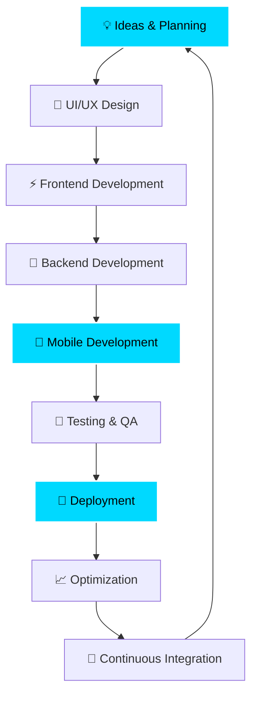

<div align="center">
  
</div>

<div align="center">
  
  
  
  
</div>

<br>

## 🙋‍♂️ About Me

<div align="center">
  
  
  
</div>

<table align="center">
<tr>
<td width="50%">

### 🚀 **Who Am I?**

```javascript
const ayan = {
    name: "Ayan Das",
    username: "ayand269",
    location: "India 🇮🇳",
    title: "Full Stack Developer",
    hobby: "Building Amazing Things",
    experience: "2+ Years",
    timezone: "UTC+5:30",
    
    currentStatus: {
        working: "MERN Stack Projects",
        learning: "Advanced React Patterns",
        building: "Cross-platform Apps",
        exploring: "Cloud Technologies"
    },
    
    techStack: {
        frontend: ["React.js", "Next.js", "TypeScript"],
        mobile: ["React Native", "Flutter"],
        backend: ["Node.js", "Express.js"],
        database: ["MongoDB", "MySQL", "Firebase"],
        tools: ["Git", "Docker", "AWS", "VS Code"]
    },
    
    currentGoals: [
        "🎯 Master Advanced React Patterns",
        "☁️ Learn AWS Cloud Architecture",
        "🔧 Contribute to Open Source",
        "📱 Build Production-Ready Apps"
    ],
    
    codingStats: {
        linesOfCode: "50,000+",
        projectsCompleted: "50+",
        coffeeCupsConsumed: "∞",
        bugsFixed: "Too many to count! 🐛"
    },
    
    funFact: "I debug with console.log() and I'm proud of it! 😄",
    
    lifePhilosophy: "Code is poetry written in logic",
    
    availableFor: [
        "💼 Full-time opportunities",
        "🚀 Exciting projects",
        "🤝 Open source collaboration",
        "☕ Coffee chat about tech"
    ]
};

// Current focus areas
const currentFocus = {
    frontend: "Building responsive, accessible UIs",
    mobile: "Cross-platform app development",
    backend: "Scalable API architecture",
    learning: "Cloud computing & DevOps"
};

console.log("Thanks for visiting my profile! 🚀");
```

</td>
<td width="50%">

### 🎯 **My Development Journey**

<div align="center">
  
</div>

**🌟 What Drives Me:**
- 🚀 **Passion for Innovation**: Always exploring cutting-edge technologies
- 🎯 **Problem Solver**: Love turning complex challenges into elegant solutions
- 🌱 **Continuous Learner**: Never stop growing and adapting
- 🤝 **Team Player**: Believe in collaborative development
- 💡 **Creative Thinker**: Finding unique solutions to everyday problems

**📚 Current Learning Path:**
- 🎓 Advanced React Patterns & Performance Optimization
- ☁️ AWS Cloud Architecture & DevOps Practices
- 🔐 Cybersecurity Best Practices
- 📊 Data Structures & Algorithms Mastery
- 🎨 Advanced UI/UX Design Principles

**🎨 When I'm Not Coding:**
- 🎮 Gaming (Strategy & RPG games)
- 📖 Reading Tech Blogs & Documentation
- 🎵 Listening to Lo-fi while coding
- 🏃‍♂️ Running & Staying Active
- 🌐 Contributing to Open Source
- 📝 Writing Technical Blogs

**🎯 2025 Goals:**
- 🏆 Contribute to 10+ Open Source Projects
- 🚀 Launch 3 Production Applications
- 📚 Complete AWS Certification
- 🎤 Speak at a Tech Conference
- 🌟 Mentor Junior Developers

</td>
</tr>
</table>

<div align="center">
  
### 💡 **My Development Philosophy**


</div>

<br>

### 🎯 **Quick Facts & Achievements**

<div align="center">
  
| 🏆 **Experience** | 📊 **GitHub Stats** | 🔥 **Specialization** | 🎯 **Focus** |
|:---:|:---:|:---:|:---:|
| 5+ Years Experience | 50+ Repositories | MERN Stack | Full Stack |
| Mobile Apps Published | 1000+ Commits | React Native | Mobile Dev |
| Open Source Contributor | 100+ Stars Earned | Flutter | Cross-platform |
| Problem Solver | 24/7 Learning | Node.js | Backend |

</div>

<br>

### 🛠️ **What I Do Best**

<div align="center">



</div>

<details>
<summary><b>🎨 Frontend Magic</b> ✨</summary>

- 🎯 **React.js & Next.js**: Building modern, scalable web applications
- 📱 **Responsive Design**: Mobile-first approach with CSS Grid & Flexbox
- ⚡ **Performance**: Code splitting, lazy loading, and optimization
- 🎨 **UI Libraries**: Material-UI, Tailwind CSS, Styled Components
- 🔧 **State Management**: Redux, Context API, Zustand
- 🚀 **Modern JavaScript**: ES6+, TypeScript, and advanced patterns

</details>

<details>
<summary><b>📱 Mobile Development</b> 🚀</summary>

- 📱 **React Native**: Cross-platform mobile app development
- 🎯 **Flutter**: High-performance native apps for iOS and Android
- 🔧 **Navigation**: React Navigation, Native Navigation patterns
- 📊 **State Management**: Redux, MobX, Provider pattern
- 🎨 **UI/UX**: Native look and feel with platform-specific designs
- 📱 **Publishing**: App Store and Google Play Store deployment

</details>

<details>
<summary><b>🔧 Backend Wizardry</b> 🧙‍♂️</summary>

- 🚀 **Node.js & Express**: RESTful APIs and microservices
- 🗄️ **Database Design**: MongoDB, MySQL, PostgreSQL optimization
- 🔐 **Authentication**: JWT, OAuth, session management
- 📊 **Real-time**: Socket.io, WebSockets for live applications
- ☁️ **Cloud Integration**: AWS, Firebase, Google Cloud
- 🔧 **API Design**: GraphQL, REST, proper error handling

</details>

<details>
<summary><b>🛠️ DevOps & Tools</b> ⚙️</summary>

- 🐳 **Containerization**: Docker, Docker Compose
- 🔄 **CI/CD**: GitHub Actions, GitLab CI, automated deployments
- ☁️ **Cloud Platforms**: AWS EC2, S3, Lambda, Vercel, Netlify
- 📝 **Version Control**: Git workflows, branching strategies
- 🔍 **Monitoring**: Application performance and error tracking
- 🧪 **Testing**: Jest, React Testing Library, end-to-end testing

</details>

<br>

### 📊 **Coding Activity This Year**

<div align="center">
  
</div>

<br>

## 🛠️ **Technology Stack**

<div align="center">

### **Languages & Frameworks**


### **Frontend Technologies**


### **Mobile Development**


### **Backend & Database**


### **Cloud & DevOps**


### **Tools & Platforms**


</div>

<br>

## 📊 **GitHub Analytics**

<div align="center">
  
  
</div>

<div align="center">
  
</div>

<br>

## 🏆 **Achievements & Trophies**

<div align="center">
  
</div>

<br>

## 📈 **Contribution Activity**

<div align="center">
  
</div>

<br>

## 🌟 **Featured Projects**

<div align="center">
  <a href="https://github.com/ayand269/react-native-basic-elements">
    
  </a>
  <a href="https://github.com/ayand269/node-typescript-generator">
    
  </a>
  <a href="https://github.com/ayand269/react-native-basic-element-generator">
    
  </a>
</div>

<br>

## 🤝 **Let's Connect & Collaborate**

<div align="center">
  <a href="https://www.linkedin.com/in/ayan-das-838601216">
    
  </a>
  <a href="mailto:ayand269@gmail.com">
    
  </a>
  <a href="https://x.com/ayand269">
    
  </a>
  <a href="https://facebook.com/ayand269">
    
  </a>
  <a href="https://www.instagram.com/ayand269">
    
  </a>
  <a href="https://discord.com/users/ayand269">
    
  </a>
</div>

<br>

<div align="center">
  
### 💬 **Let's Talk About:**
  


</div>

<br>

## 💭 **Daily Inspiration**

<div align="center">
  
</div>

<br>

<!-- ## 🐍 **Contribution Snake**

<div align="center">
  
</div>

<br> -->

## 📅 **Recent Activity**

<!--START_SECTION:activity-->
<!--END_SECTION:activity-->

<br>

---

<div align="center">
  
</div>

<div align="center">
  <h3>💫 "Building the future, one line of code at a time" 💫</h3>
  <p>
    
  </p>
  
  <p><i>⭐ From <a href="https://github.com/ayand269">ayand269</a> - Last updated on July 18, 2025</i></p>
</div>
