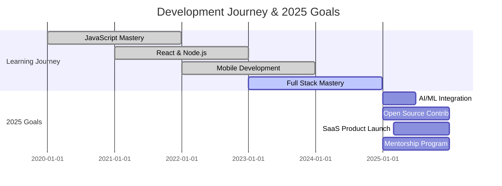

<div align="center">
  
</div>

<p align="center">
  
  
  
</p>

---

## 🚀 About Me

```javascript
const ayanDas = {
  pronouns: "He/Him",
  location: "India 🇮🇳",
  experience: "5+ Years",
  currentRole: "Full Stack Developer",
  
  workingOn: {
    frontend: ["React.js", "React Native", "Flutter", "Next.js"],
    backend: ["Node.js", "Express.js", "FastAPI", "Django"],
    mobile: ["React Native", "Flutter"],
    databases: ["MongoDB", "PostgreSQL", "MySQL", "Firebase"],
    cloud: ["AWS", "Google Cloud", "Vercel", "Netlify"]
  },
  
  learning: ["Machine Learning", "DevOps", "Microservices", "Web3"],
  
  askMeAbout: [
    "JavaScript", "React", "Node.js", "Mobile Development", 
    "System Design", "Database Design", "API Development"
  ],
  
  funFact: "I debug code faster than I write it! 🐛✨",
  
  lifePhilosophy: "Code is poetry written in logic",
  
  goals2025: [
    "Master AI/ML integration in web apps",
    "Contribute to 5+ open source projects",
    "Build a SaaS product with 1000+ users",
    "Mentor 10+ junior developers"
  ]
};
```

<div align="center">
  
### 💭 *"The best way to predict the future is to create it"*
  
</div>

---

## 📊 Quick Facts

<div align="center">
  <table>
    <tr>
      <td><strong>🔭 Current Focus</strong></td>
      <td>Full Stack Development & Mobile Apps</td>
    </tr>
    <tr>
      <td><strong>💼 Experience</strong></td>
      <td>5+ Years</td>
    </tr>
    <tr>
      <td><strong>🌟 Projects Completed</strong></td>
      <td>50+</td>
    </tr>
    <tr>
      <td><strong>🏆 GitHub Contributions</strong></td>
      <td>500+ commits this year</td>
    </tr>
    <tr>
      <td><strong>🎯 Current Goal</strong></td>
      <td>Building scalable applications</td>
    </tr>
    <tr>
      <td><strong>📚 Learning</strong></td>
      <td>AI/ML, DevOps, Microservices</td>
    </tr>
  </table>
</div>

---

## 🛠️ Technology Stack

<div align="center">

### Frontend Development


### Backend Development


### Mobile Development


### Database & Cloud


### Tools & Technologies


</div>

---

## 💻 Development Philosophy

<div align="center">
  
</div>

<details>
<summary><strong>🎯 My Development Approach</strong></summary>

```yaml
coding_principles:
  - "Write code that tells a story"
  - "Test early, test often"
  - "Performance is a feature"
  - "User experience is everything"
  - "Continuous learning is key"

workflow:
  planning: "Understand the problem deeply"
  design: "Create scalable architecture"
  development: "Write clean, maintainable code"
  testing: "Comprehensive test coverage"
  deployment: "Automated CI/CD pipeline"
  monitoring: "Performance & error tracking"
```

</details>

---

## 🚀 Featured Projects

<div align="center">
  <table>
    <tr>
      <td width="50%">
        <h3 align="center">Project Portfolio</h3>
        <div align="center">
          <a href="https://github.com/ayand269" target="_blank">
            
          </a>
          <p><strong>Personal Portfolio</strong> - Modern React portfolio with animations</p>
        </div>
      </td>
      <td width="50%">
        <h3 align="center">Mobile App</h3>
        <div align="center">
          <a href="https://github.com/ayand269" target="_blank">
            
          </a>
          <p><strong>React Native App</strong> - Cross-platform mobile application</p>
        </div>
      </td>
    </tr>
  </table>
</div>

---

## 📈 GitHub Analytics

<div align="center">
  
  
</div>

<div align="center">
  
</div>

<div align="center">
  
</div>

---

## 🏆 GitHub Trophies

<div align="center">
  
</div>

---

## ⚡ Coding Activity

<div align="center">
  
</div>

<!--START_SECTION:waka-->
<!--END_SECTION:waka-->

---

## 🌟 Skills Deep Dive

<details>
<summary><strong>Frontend Development</strong></summary>

### 🎨 Frontend Expertise
- **React.js**: Advanced hooks, context API, performance optimization
- **Next.js**: SSR, SSG, API routes, deployment optimization
- **TypeScript**: Strong typing, advanced patterns, type safety
- **State Management**: Redux, Context API, Zustand
- **Styling**: Tailwind CSS, Styled Components, CSS Modules
- **Animation**: Framer Motion, GSAP, CSS animations
- **Testing**: Jest, React Testing Library, Cypress

</details>

<details>
<summary><strong>Backend Development</strong></summary>

### 🔧 Backend Expertise
- **Node.js**: Express, Fastify, middleware development
- **Python**: FastAPI, Django, Flask, async programming
- **Database Design**: MongoDB, PostgreSQL, MySQL, Redis
- **API Development**: RESTful APIs, GraphQL, WebSockets
- **Authentication**: JWT, OAuth, Auth0, Firebase Auth
- **Microservices**: Service architecture, API gateways
- **Testing**: Unit testing, integration testing, API testing

</details>

<details>
<summary><strong>Mobile Development</strong></summary>

### 📱 Mobile Expertise
- **React Native**: Cross-platform development, native modules
- **Flutter**: Dart, widget customization, state management
- **Performance**: Memory optimization, lazy loading, caching
- **Platform Integration**: Native iOS/Android features
- **State Management**: Redux, MobX, Provider pattern
- **Testing**: Unit testing, widget testing, integration testing

</details>

<details>
<summary><strong>DevOps & Cloud</strong></summary>

### ☁️ DevOps Expertise
- **Cloud Platforms**: AWS, Google Cloud, Azure
- **Containerization**: Docker, Kubernetes basics
- **CI/CD**: GitHub Actions, Jenkins, GitLab CI
- **Monitoring**: Error tracking, performance monitoring
- **Deployment**: Vercel, Netlify, Heroku, VPS
- **Version Control**: Git workflows, branching strategies

</details>

---

## 📅 Development Timeline & Goals



---

## 🤝 Connect With Me

<div align="center">
  <a href="https://www.linkedin.com/in/ayan-das-838601216" target="_blank">
    
  </a>
  <a href="mailto:ayand269@gmail.com">
    
  </a>
  <a href="https://x.com/ayand269" target="_blank">
    
  </a>
  <a href="https://discord.gg/ayand269" target="_blank">
    
  </a>
  <a href="https://facebook.com/ayand269" target="_blank">
    
  </a>
  <a href="https://www.instagram.com/ayand269" target="_blank">
    
  </a>
</div>

---

## 💬 Let's Collaborate!

<div align="center">
  
### 🌟 Open to exciting opportunities in:
- **Full Stack Development Projects**
- **Mobile App Development**
- **Open Source Contributions**
- **Technical Mentorship**
- **Startup Collaborations**

### 📧 Professional Contact
**Email**: ayand269@gmail.com  
**LinkedIn**: [Ayan Das](https://www.linkedin.com/in/ayan-das-838601216)  
**Response Time**: Usually within 24 hours

</div>

---

<div align="center">
  
  
  <p><em>⭐ If you like my work, consider starring my repositories!</em></p>
  
  
</div>